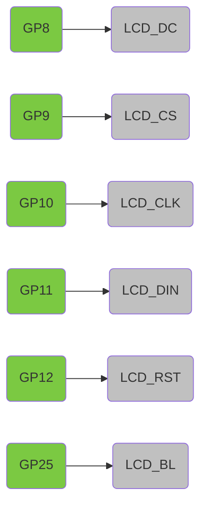

# MicroPython code for the Waveshare RP2040-LCD 0.96"

- [product page](https://www.waveshare.com/rp2040-lcd-0.96.htm)
- [wiki](https://www.waveshare.com/wiki/RP2040-LCD-0.96)

The board is similar to a Raspberry Pi Pico: same dimensions, with USB-C and a 0.96" 160x80 LCD (ST7735) mounted on the front, and a MX1.25 battery header.

## LCD pins

## Code

- Initial experiment using the [MicroPython-ST7735 driver](https://github.com/boochow/MicroPython-ST7735) seems to work well. Modified the bitmap sample to match the appropriate pins.
